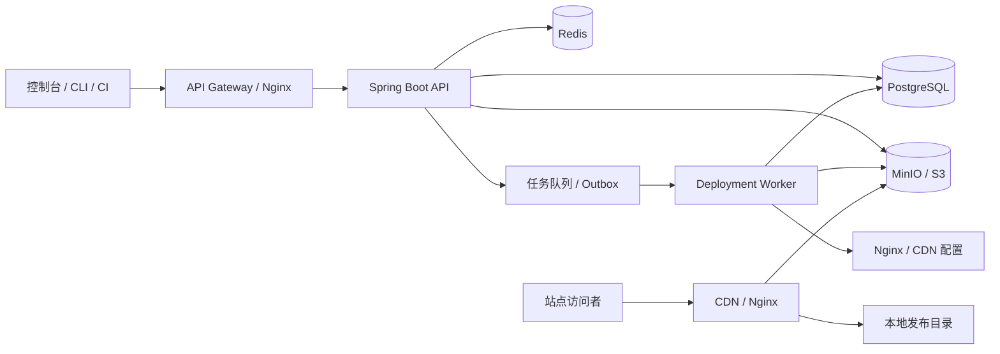
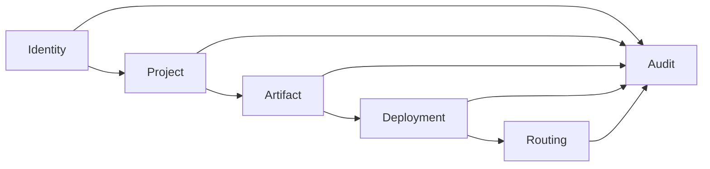

# HTML 部署平台技术方案

## 1. 文档信息

- 目标技术栈：JDK 21 LTS
- 平台类型：多租户静态 HTML 部署平台
- 后端架构：DDD 分层架构 + 单后端模块 + 限界上下文作为包边界
- 适用场景：HTML/CSS/JavaScript 静态站点、活动页、文档站、原型页、小型前端产物
- 文档版本：v1.2
- 当前工作区状态：绿地项目，尚无既有代码约束

## 2. 建设目标

平台需要提供从“上传静态站点”到“可访问 HTTPS 地址”的完整闭环，核心能力包括：

1. 用户通过控制台、API 或 CI/CD 上传 HTML 静态包。
2. 平台对压缩包进行安全校验、文件规范化和版本固化。
3. 每个项目拥有独立的预览地址、生产地址和部署版本。
4. 支持发布、回滚、停用、删除和访问控制。
5. 支持默认子域名和经过验证的自定义域名。
6. 支持多租户、RBAC、审计日志、配额和可观测性。
7. 部署过程可追踪、可重试、可审计，发布失败不影响当前在线版本。

## 3. 范围边界

### 3.1 一期范围

- 上传 ZIP 格式的纯静态资源。
- 提供管理控制台和 REST API。
- 支持默认子域名访问。
- 支持自定义域名绑定和 HTTPS。
- 支持部署历史、版本激活和回滚。
- 支持项目成员、访问令牌和基础 RBAC。
- 支持 CDN 缓存刷新和基础访问日志。

### 3.2 一期不包含

- 在线代码编辑器。
- 服务端运行环境，例如 Node.js、Java、Python 应用托管。
- 数据库、对象存储和队列等后端资源托管。
- 用户在平台上执行任意构建脚本。
- 任意远程 Git 仓库拉取，避免 SSRF 和凭据泄漏风险。

如果后续需要支持 Vite、React、Vue 等源码构建，建议新增隔离的构建集群，而不是让部署服务直接执行用户代码。

## 4. 总体架构



架构分为控制面、任务面和内容面：

- 控制面：Spring Boot API，负责认证、租户、项目、部署记录和域名管理。
- 任务面：Deployment Worker，负责下载产物、校验 ZIP、解压、计算哈希、生成发布目录和刷新缓存。
- 内容面：Nginx、CDN 或对象存储，只负责高并发静态文件读取。

控制面与内容面必须解耦。在线站点访问不依赖 Spring Boot 进程，避免 API 发布或重启导致站点不可访问。

## 5. 技术选型

| 层级 | 推荐技术 | 说明 |
| --- | --- | --- |
| 语言 | JDK 21 LTS | 使用 virtual threads、record、sealed class、pattern matching |
| 后端框架 | Spring Boot 3.5.x | 若团队生态已适配，可评估 Spring Boot 4.x |
| Web | Spring MVC + Tomcat | 平台 API 属于 I/O 密集型，可启用虚拟线程 |
| 架构约束 | ArchUnit（主），Spring Modulith（可选） | 校验 DDD 分层、上下文包依赖和 Repository 规则 |
| 参数校验 | Jakarta Validation | DTO 与配置项统一校验 |
| 持久化 | Spring JDBC + JdbcClient + Flyway | 显式 SQL 和 Repository Adapter，避免 ORM 模型侵入领域层 |
| 数据库 | PostgreSQL 16+ | 多租户、JSONB、事务和审计能力成熟 |
| 缓存与限流 | Redis 7+ | 会话、令牌、限流、分布式锁和短期任务状态 |
| 对象存储 | MinIO 或 S3 兼容存储 | 保存原始 ZIP、规范化产物和可选备份 |
| 内容服务 | Nginx + CDN | 默认使用 Nginx 本地发布目录，规模化后切换 CDN 回源 |
| 异步任务 | PostgreSQL Outbox + Worker | 一期避免引入复杂 MQ，后续可替换 RabbitMQ 或 Kafka |
| 前端 | Vue 3 + TypeScript + Vite | 适合控制台、表单、表格和部署状态展示 |
| 可观测性 | Micrometer + Prometheus + Grafana + Loki | 指标、日志和告警统一接入 |
| 链路追踪 | OpenTelemetry | 为 API、Worker、存储调用建立 trace |
| 容器化 | Docker + Docker Compose | 单机起步，生产可迁移 Kubernetes |
| 测试 | JUnit 5 + Testcontainers + Playwright | 单元、集成、端到端和安全测试 |

### 5.1 JDK 21 使用原则

推荐启用：

```yaml
spring:
  threads:
    virtual:
      enabled: true
```

适用场景：

- API 请求。
- Worker 下载、解压、上传对象存储。
- 对数据库、Redis、MinIO 的阻塞式 I/O 调用。

需要注意：

- 不要在虚拟线程中执行 CPU 密集型压缩或哈希计算，应使用专用工作线程池。
- 避免在 I/O 边界使用长临界区 `synchronized`，防止线程固定。
- Structured Concurrency 在 JDK 21 中仍属于预览特性，生产代码不建议启用 preview。
- 使用 `record` 表达不可变 DTO，使用 pattern matching 简化状态处理。

## 6. DDD 架构与限界上下文

后端采用 DDD 战略设计和战术设计，首版以单模块 DDD 分层单体落地。限界上下文作为包边界存在，不作为独立 Maven 模块。

核心原则：

- 顶层优先采用最普遍的 `interfaces/application/domain/infrastructure` 四层目录。
- 每一层内部再按 `identity/project/artifact/deployment/routing/audit` 这些上下文分包。
- 限界上下文不再作为物理模块，避免在 MVP 阶段产生过多模块和构建配置。
- 领域模型不依赖 Spring、JPA、HTTP、Redis 或对象存储 SDK。
- 聚合内部保持强一致，跨聚合和跨上下文使用领域事件与最终一致性。
- 上下文之间只共享标识、只读契约和集成事件，不共享领域对象。
- 首版不采用完整事件溯源或重型 CQRS，避免复杂度超过业务收益。
- 所有写操作用例显式建模为 Command，查询可按需使用轻量 Query 和读模型。

### 6.1 限界上下文

| 限界上下文 | 职责 | 核心聚合 | 主要事件 |
| --- | --- | --- | --- |
| Identity | 用户、租户、成员、角色、登录 | UserAccount, Tenant | TenantCreated, MemberJoined, MemberRoleChanged |
| Project | 项目、环境、项目配置、访问令牌 | Project, AccessToken | ProjectCreated, EnvironmentCreated, TokenIssued |
| Artifact | 上传产物、内容校验、产物固化 | Artifact | ArtifactUploaded, ArtifactValidated, ArtifactRejected |
| Deployment | 部署状态机、发布、激活、回滚 | Deployment, ReleaseChannel | DeploymentRequested, DeploymentActivated, DeploymentFailed |
| Routing | 默认域名、自定义域名、证书和路由目标 | DomainBinding | DomainBound, DomainVerified, CertificateIssued |
| Audit | 审计记录、操作追踪、合规查询 | AuditRecord | AuditRecorded |

Worker 不是独立限界上下文，它属于部署任务的技术执行端，通过应用端口调用各上下文的公开用例。

### 6.2 上下文映射



依赖方向说明：

- Project 保存 `tenantId`，不直接引用 Identity 的聚合。
- Artifact 保存 `projectId`，只依赖 Project 发布的只读契约。
- Deployment 消费 `ArtifactValidated`，通过 `artifactId` 建立关联。
- Routing 消费 `DeploymentActivated`，将域名路由到部署版本。
- Audit 订阅各上下文发布的集成事件，不能反向修改业务数据。
- 跨上下文协作优先使用事件；需要同步查询时，只调用对方 Application 层的公开 Query API。

### 6.3 DDD 分层

整个后端统一采用四层结构：

```text
interfaces -> application -> domain
                    ^
                    |
              infrastructure
```

依赖规则：

| 层 | 职责 | 允许依赖 |
| --- | --- | --- |
| interfaces | REST、CLI、消息入口、DTO 和参数绑定 | application |
| application | 用例编排、事务边界、权限检查、事件发布 | domain、共享契约 |
| domain | 聚合、实体、值对象、领域服务、领域事件、Repository 接口 | 仅 JDK 和必要的基础库 |
| infrastructure | JPA、Redis、MinIO、Nginx、邮件、第三方 API 实现 | domain 接口、application 端口 |

强制约束：

- `domain` 不能依赖 Spring、Jakarta Persistence、Jackson 或其他框架。
- `application` 不能直接操作 JPA Repository、Redis 客户端或对象存储 SDK。
- `interfaces` 不能绕过 Application 层直接调用 Repository。
- `infrastructure` 只实现端口，不能包含核心业务规则。
- 四层内部统一按业务上下文分包，避免所有业务模型混在全局 `domain.model` 下。
- 同一业务上下文内通过构造器注入依赖，禁止全局 Service Locator。

### 6.4 包结构

首版后端使用单个 Maven 模块，根包固定为四层，每层内部再按业务上下文分包：

```text
backend/
  pom.xml
  src/main/java/com/example/htmldeploy/
    HtmlDeployApplication.java
    interfaces/
      rest/
        identity/
        project/
        artifact/
        deployment/
        routing/
      worker/
      cli/
    application/
      identity/
      project/
      artifact/
      deployment/
      routing/
      dto/
      assembler/
      port/
    domain/
      identity/
        model/
        event/
        repository/
        service/
      project/
      artifact/
      deployment/
      routing/
      audit/
      shared/
    infrastructure/
      persistence/
        identity/
        project/
        artifact/
        deployment/
        routing/
        audit/
      storage/
      cache/
      nginx/
      security/
      config/
```

目录称谓统一如下：

- `domain.artifact.model`：Artifact 聚合和值对象。
- `domain.artifact.repository`：Artifact Repository 接口。
- `application.artifact`：上传、校验和固化产物的用例。
- `infrastructure.persistence.artifact`：Artifact Repository 实现和持久化对象。
- `interfaces.rest.artifact`：Artifact REST Controller 和请求响应 DTO。

`domain.shared` 只允许放真正跨上下文通用的基础模型，例如 `DomainEvent` 接口、通用标识和领域异常。不能把具体业务实体放入 `shared`。

### 6.5 战术模型

#### Identity

- `UserAccount`：用户登录身份和凭据。
- `Tenant`：租户聚合根，内部包含 `TenantMember` 实体。
- 值对象：`UserId`、`TenantId`、`Email`、`Role`、`TenantSlug`。
- 领域规则：租户 slug 全局唯一；成员角色变更不能移除最后一个租户所有者。

#### Project

- `Project`：项目聚合根，内部维护 `Environment`。
- `AccessToken`：独立聚合并保存 Token 哈希、scope 和过期时间。
- 值对象：`ProjectId`、`ProjectSlug`、`EnvironmentName`、`TokenScope`。
- 领域规则：项目 slug 在租户内唯一；至少保留一个生产环境；Token 明文只在创建时返回。

#### Artifact

- `Artifact`：静态产物聚合根，状态为 `CREATED`、`UPLOADED`、`VALIDATING`、`READY` 或 `REJECTED`。
- `ArtifactManifest`：文件数量、文件清单、总大小和入口文件。
- 值对象：`ArtifactId`、`ObjectKey`、`Sha256`、`ArtifactStatus`。
- 领域服务：`ArchiveValidationService` 定义 ZIP 安全规则。
- 端口：`ArtifactStorage`、`ArchiveInspector`、`MalwareScanner`。
- 领域规则：`READY` 产物不可修改；同一项目相同 SHA-256 只保留一份业务记录。

#### Deployment

- `Deployment`：部署生命周期聚合根。
- `ReleaseChannel`：按项目和环境保护唯一 active release 指针的聚合。
- 值对象：`DeploymentId`、`ReleaseVersion`、`DeploymentStatus`、`ReleaseTarget`。
- 领域服务：`DeploymentPolicy` 判断是否允许部署、回滚和强制发布。
- 领域规则：版本号在项目内单调递增；同一环境只有一个 active deployment；回滚创建新部署记录。

#### Routing

- `DomainBinding`：域名绑定聚合根。
- `DnsVerification`：TXT 记录、验证时间和状态。
- `CertificateState`：证书状态、到期时间和续期结果。
- 值对象：`DomainId`、`Hostname`、`VerifyToken`、`RouteTarget`。
- 领域规则：域名必须验证后才可启用；同一 Hostname 只能绑定一个生产环境。

#### Audit

- `AuditRecord`：只追加、不修改的审计聚合。
- 值对象：`ActorId`、`ActionType`、`ResourceRef`。
- 审计上下文只消费事件，不参与业务流程回写。

### 6.6 聚合与一致性边界

默认一次事务只修改一个聚合：

| 操作 | 强一致范围 | 最终一致部分 |
| --- | --- | --- |
| 创建项目 | Project | 审计记录 |
| 完成上传 | Artifact | 审计记录、后续校验任务 |
| 产物校验 | Artifact | Deployment 可用产物缓存、审计 |
| 创建部署 | Deployment | ReleaseChannel 初始状态、审计 |
| 激活部署 | ReleaseChannel、Deployment | 路由更新、缓存刷新、审计 |
| 回滚 | Deployment、ReleaseChannel | 路由更新、缓存刷新、审计 |
| 域名验证 | DomainBinding | 路由配置和证书更新 |

同一上下文内确有强一致要求时，可以在一个应用服务事务中修改多个聚合，但必须明确理由并加测试。跨上下文禁止使用分布式事务。

### 6.7 应用服务与用例

Application 层使用 Command Handler 表达写用例：

| 用例 | Command | 关键协作 |
| --- | --- | --- |
| 创建租户 | `CreateTenantCommand` | 校验 slug，创建 Tenant，记录审计 |
| 邀请成员 | `InviteMemberCommand` | 校验权限，修改 Tenant 聚合 |
| 创建项目 | `CreateProjectCommand` | 校验租户配额，创建 Project |
| 创建上传 | `CreateArtifactUploadCommand` | 创建 Artifact，生成预签名 URL |
| 完成上传 | `CompleteArtifactUploadCommand` | 校验对象存在，发布上传完成事件 |
| 校验产物 | `ValidateArtifactCommand` | Worker 调用校验领域服务，固化 Artifact |
| 创建部署 | `CreateDeploymentCommand` | 校验 READY 产物和环境策略 |
| 激活部署 | `ActivateDeploymentCommand` | 修改 ReleaseChannel 和 Deployment |
| 回滚版本 | `RollbackDeploymentCommand` | 基于历史产物创建新 Deployment |
| 绑定域名 | `BindDomainCommand` | 创建 DomainBinding 和验证信息 |
| 验证域名 | `VerifyDomainCommand` | 校验 DNS，更新聚合状态 |

查询不强制经过聚合重建，可以使用专门的读模型：

- 项目列表按租户和关键字分页。
- 部署列表展示版本、状态、耗时和操作者。
- 审计日志按时间、操作者和资源检索。
- 读模型可使用 `JdbcClient` 直接查询优化后的 SQL。

### 6.8 领域事件与集成事件

领域事件表示上下文内部已发生的业务事实，集成事件用于跨上下文发布。

```text
TenantCreated
ProjectCreated
ArtifactUploaded
ArtifactValidated
ArtifactRejected
DeploymentRequested
DeploymentActivated
DeploymentFailed
DomainVerified
```

事件命名统一使用过去时，事件载荷只包含消费方需要的最小字段：

```json
{
  "eventId": "evt_01J...",
  "eventType": "ArtifactValidated",
  "aggregateId": "art_01J...",
  "tenantId": "ten_01J...",
  "projectId": "prj_01J...",
  "occurredAt": "2026-10-04T03:20:00Z",
  "payload": {
    "sha256": "5f4dcc3b...",
    "manifestVersion": 1
  }
}
```

发布规则：

- 领域事件使用 Spring `ApplicationEventPublisher` 在进程内发布。
- 需要跨上下文或跨进程的事件先写入 Outbox，再由发布器投递。
- Outbox 必须与聚合状态在同一数据库事务中写入。
- 消费者按 `eventId` 幂等，允许至少一次投递。
- 领域事件对象不能直接作为 REST DTO，集成事件也不能暴露聚合内部结构。

### 6.9 事务与最终一致性

部署发布跨越数据库、对象存储、Nginx 和 CDN，无法使用单个本地事务完成。实现上采用状态机和补偿：

1. 创建 Deployment，状态为 `CREATED`。
2. 写入 `DeploymentRequested`，事务提交后 Worker 开始执行。
3. Worker 完成内容同步，调用激活命令。
4. 在同一数据库事务中更新 ReleaseChannel 指针和 Deployment 状态。
5. 事务提交后刷新缓存和 CDN，失败则重试。
6. 达到最大重试次数后进入人工处理或自动补偿。

任何外部调用都不应包在数据库长事务中。数据库事务内只做状态变更和 Outbox 写入。

### 6.10 Java 21 领域模型示例

领域对象使用普通 Java 类和 `record`，不要继承 JPA Entity：

```java
public record ArtifactId(UUID value) {
    public ArtifactId {
        Objects.requireNonNull(value, "value must not be null");
    }
}

public record Sha256(String value) {
    public Sha256 {
        if (value == null || !value.matches("[0-9a-f]{64}")) {
            throw new IllegalArgumentException("invalid sha256");
        }
    }
}

public final class Artifact {
    private final ArtifactId id;
    private ArtifactStatus status;
    private Sha256 sha256;
    private ArtifactManifest manifest;

    public static Artifact create(ArtifactId id, ProjectId projectId) {
        return new Artifact(id, projectId, ArtifactStatus.CREATED);
    }

    public void markValidated(Sha256 digest, ArtifactManifest manifest) {
        if (status != ArtifactStatus.VALIDATING) {
            throw new IllegalStateException("artifact is not validating");
        }
        this.sha256 = Objects.requireNonNull(digest);
        this.manifest = Objects.requireNonNull(manifest);
        this.status = ArtifactStatus.READY;
    }
}
```

Application 层示例：

```java
@Service
public final class CompleteArtifactUploadHandler {
    private final ArtifactRepository repository;
    private final ArtifactStorage storage;
    private final DomainEventPublisher events;

    @Transactional
    public void handle(CompleteArtifactUploadCommand command) {
        Artifact artifact = repository.findById(command.artifactId())
            .orElseThrow(ArtifactNotFoundException::new);
        artifact.markUploaded(storage.stat(command.objectKey()));
        repository.save(artifact);
        events.publish(ArtifactUploaded.from(artifact));
    }
}
```

示例只用于说明依赖方向。真实实现还需要权限检查、乐观锁、Audit 和 Outbox。

### 6.11 边界治理

由于首版不按上下文拆物理模块，必须使用 ArchUnit 自动校验职责边界：

- `domain` 不依赖 `application`、`infrastructure` 和框架包。
- `interfaces` 不直接依赖 Repository 和基础设施实现。
- `domain.{context}` 不能访问其他 `domain.{otherContext}` 包。
- 跨上下文协作只能调用对方 `application.{context}` 的公开用例或消费集成事件。
- Repository 接口位于 `domain.{context}.repository`，实现位于 `infrastructure.persistence.{context}`。
- 聚合可以引用其他聚合的 ID，但不能持有其他聚合的对象引用。
- REST DTO、Command、领域对象和持久化对象分别建模。

Spring Modulith 可以作为可选补充，但首版不把它作为目录设计前提。限界上下文主要通过包命名、ArchUnit 和代码评审保持边界。

不建议在 MVP 使用完整事件溯源。只有审计、合规或高频时间序列场景明确需要时，才针对单个聚合评估事件存储。

## 7. 核心领域模型

### 7.1 聚合与持久化映射

| 聚合根 | 标识 | 内部对象 | 主要持久化表 |
| --- | --- | --- | --- |
| UserAccount | UserId | Credential | user_account |
| Tenant | TenantId | TenantMember | tenant, tenant_member |
| Project | ProjectId | Environment | project, project_environment |
| AccessToken | TokenId | Scope | access_token |
| Artifact | ArtifactId | ArtifactManifest | artifact |
| Deployment | DeploymentId | DeploymentStep | deployment |
| ReleaseChannel | ChannelId | ActiveRelease | release_channel |
| DomainBinding | DomainId | DnsVerification, CertificateState | domain_binding |
| AuditRecord | AuditId | 无 | audit_log |

首版使用 `JdbcClient` 在 Repository Adapter 中显式完成映射，不为聚合引入 JPA Entity：

```text
domain.artifact.model.Artifact
infrastructure.persistence.artifact.ArtifactRepositoryAdapter
```

Repository Adapter 负责 SQL、UUID、时间和 JSON 字段转换。领域对象不继承框架类型，也不依赖 ORM 延迟加载；后续如果引入 JPA，也必须继续遵守同样的分离原则。

### 7.2 核心不变量

- `tenant.slug` 全局唯一。
- `project.slug` 在租户内唯一。
- `artifact.sha256` 在项目内建立查询索引，允许相同内容重复发布；校验完成的产物记录不可修改。
- `deployment.version` 在项目内单调递增。
- `release_channel` 对 `project_id + environment` 建立唯一约束。
- 每个环境同一时间只有一个 active release。
- 回滚必须基于已经验证通过的 artifact。
- 自定义域名必须验证成功后才能绑定 active release。
- 审计记录只追加，不提供更新和删除接口。

### 7.3 部署状态机

```text
CREATED
  -> VALIDATING
  -> READY
  -> DEPLOYING
  -> SUCCEEDED
  -> ACTIVE
  -> SUPERSEDED

任意处理阶段 -> FAILED
```

回滚不回写历史部署，而是基于旧 artifact 创建一条新部署记录：

```text
rollback(project, targetVersion)
  -> create deployment from target artifact
  -> deploy new immutable release
  -> switch active pointer
```

这种方式保证所有发布行为都有完整审计记录，也避免历史状态被覆盖。

## 8. 部署流程

### 8.1 上传阶段

推荐使用预签名 URL，避免文件流经过 API 进程。

1. 客户端调用 `POST /api/v1/projects/{projectId}/artifacts`。
2. API 创建 artifact 记录并返回 `artifact_id` 和预签名上传 URL。
3. 客户端直接上传 ZIP 到 MinIO 或 S3。
4. 客户端调用 `POST /api/v1/artifacts/{artifactId}/complete`。
5. API 校验对象是否存在、大小和租户归属，然后写入 Outbox。

如果一期需要简单实现，也可以使用 multipart 上传，但 API 必须限制请求体大小并启用临时文件清理。

### 8.2 校验阶段

Worker 必须完成以下检查：

- ZIP 格式有效，文件数量不超过配额。
- 压缩包大小、解压总大小和单文件大小均不超过限制。
- 拒绝绝对路径、`..` 路径、符号链接和特殊设备文件。
- 拒绝 `.exe`、`.dll`、`.so` 等非静态文件类型。
- 规范化文件名，禁止控制字符和超长路径。
- 必须存在根目录 `index.html`，或根据项目配置指定入口文件。
- 检查重复路径和大小写冲突。
- 可选接入 ClamAV 做恶意文件扫描。
- 可选扫描 API Key、私钥等敏感内容并给出告警。

建议默认限制：

| 项目 | 默认值 |
| --- | --- |
| ZIP 大小 | 100 MiB |
| 解压后大小 | 500 MiB |
| 文件数量 | 10,000 |
| 单文件大小 | 100 MiB |
| 路径长度 | 512 字符 |
| 解压超时 | 120 秒 |

### 8.3 固化阶段

1. Worker 计算 ZIP 和规范化内容的 SHA-256。
2. 将解压后的内容写入临时目录。
3. 校验全部通过后写入不可变 release 目录或对象存储前缀。
4. release 路径使用 `deployment_id` 和内容哈希标识，禁止覆盖历史版本。
5. 更新 deployment 状态为 `READY`。

### 8.4 发布阶段

1. 获取项目发布锁，确认没有其他部署正在执行。
2. 将 release 内容同步到目标内容节点或 CDN 回源存储。
3. 原子切换 active pointer。
4. 刷新 CDN 的 HTML 和清单文件缓存。
5. 执行健康检查，访问入口文件并验证 HTTP 状态码。
6. 更新 deployment 为 `ACTIVE`，旧版本改名为 `SUPERSEDED`。
7. 写入审计日志和指标。

单机 Nginx 可使用符号链接实现原子切换：

```text
/srv/html-deploy/releases/{project_id}/{deployment_id}/
/srv/html-deploy/www/{project_slug}/current -> ../../releases/{project_id}/{deployment_id}
```

切换方式：

```text
ln -sfn target_path temp_link
mv -T temp_link current
```

生产环境如果使用对象存储和 CDN，则 active pointer 应保存在数据库和缓存中，CDN 根据 Host 路由到对应前缀。

## 9. 静态资源访问与路由

### 9.1 默认域名

推荐格式：

```text
https://{tenant-slug}-{project-slug}.apps.example.com
```

不要直接使用用户输入的完整 Host 拼接 Nginx 配置。所有域名标识必须经过 slug 规范化、白名单校验和唯一性约束。

### 9.2 自定义域名

绑定流程：

1. 用户提交域名。
2. 平台生成 DNS TXT 验证值。
3. 用户在自己的 DNS 服务商添加 TXT 记录。
4. Worker 查询并验证 TXT。
5. 验证通过后签发或加载 TLS 证书。
6. 生成路由配置并平滑 reload Nginx 或调用 CDN API。

建议使用 ACME 自动签发，但必须设置域名验证、签发频率限制和失败告警。

### 9.3 缓存策略

推荐默认值：

| 资源 | Cache-Control |
| --- | --- |
| `index.html` | `public, max-age=60, must-revalidate` |
| 未指纹化 JS/CSS | `public, max-age=3600` |
| 指纹化静态资源 | `public, max-age=31536000, immutable` |
| 发布清单 | `no-cache` |

平台应允许项目级覆盖，但必须限制危险配置，例如对 `index.html` 设置一年强缓存。

所有站点响应建议增加：

```text
X-Content-Type-Options: nosniff
Referrer-Policy: strict-origin-when-cross-origin
Permissions-Policy: camera=(), microphone=(), geolocation=()
```

CSP 和 CORS 默认不强制注入，避免破坏用户站点；可在项目配置中开启。

## 10. API 设计

### 10.1 规范

- API 前缀：`/api/v1`
- 认证方式：短期 JWT + 刷新令牌，CI 使用项目 Access Token
- 时间格式：ISO 8601 UTC
- 分页：cursor 或 page/size，统一响应结构
- 幂等：创建部署支持 `Idempotency-Key`
- 错误：统一错误码，例如 `ARTIFACT_TOO_LARGE`

### 10.2 核心接口

```http
POST   /api/v1/tenants
GET    /api/v1/tenants/{tenantId}/projects
POST   /api/v1/projects

POST   /api/v1/projects/{projectId}/artifacts
POST   /api/v1/artifacts/{artifactId}/complete
GET    /api/v1/artifacts/{artifactId}

POST   /api/v1/projects/{projectId}/deployments
GET    /api/v1/projects/{projectId}/deployments
GET    /api/v1/deployments/{deploymentId}
POST   /api/v1/deployments/{deploymentId}/rollback
POST   /api/v1/projects/{projectId}/deployments/{deploymentId}/activate

POST   /api/v1/projects/{projectId}/domains
POST   /api/v1/domains/{domainId}/verify
DELETE /api/v1/domains/{domainId}

POST   /api/v1/projects/{projectId}/tokens
DELETE /api/v1/tokens/{tokenId}
```

### 10.3 创建部署请求示例

```json
{
  "artifactId": "art_01J...",
  "environment": "production",
  "releaseNote": "国庆活动页第一版"
}
```

### 10.4 状态查询响应示例

```json
{
  "id": "dep_01J...",
  "projectId": "prj_01J...",
  "version": 18,
  "status": "ACTIVE",
  "url": "https://demo-activity.apps.example.com",
  "artifactSha256": "5f4dcc3b...",
  "createdAt": "2026-10-04T03:20:00Z",
  "finishedAt": "2026-10-04T03:20:14Z"
}
```

## 11. 权限模型

建议采用 RBAC：

| 角色 | 权限 |
| --- | --- |
| PLATFORM_ADMIN | 平台配置、租户管理、全局审计 |
| TENANT_OWNER | 租户成员、配额、所有项目 |
| PROJECT_MAINTAINER | 上传、部署、回滚、域名管理 |
| DEVELOPER | 上传、创建部署、查看日志 |
| VIEWER | 只读查看项目和部署 |

Access Token 使用最小 scope，格式建议：

```text
artifact:write
deployment:create
deployment:read
```

Token 只保存哈希，不保存明文；创建时仅展示一次。

## 12. 安全设计

### 12.1 隔离边界

- 管理控制台和用户静态站点必须使用不同域名或至少不同站点配置。
- 用户站点禁止读取平台管理域 Cookie。
- 用户内容不运行在 API 进程内。
- Worker 解压目录使用独立系统用户和最小权限。
- 内容节点只读挂载发布目录。

### 12.2 ZIP 与文件安全

- 防止 Zip Slip。
- 防止 Zip Bomb。
- 禁止符号链接和设备文件。
- 限制解压并发和磁盘配额。
- 校验 MIME 类型，但不要只依赖扩展名。
- 使用内容哈希避免重复文件覆盖。

### 12.3 应用安全

- 密码使用 Argon2id 或 BCrypt。
- JWT 使用非对称签名和短有效期。
- 管理 API 启用 CSRF 防护或采用严格的 SameSite Cookie。
- 登录、上传、部署和域名验证接口启用 Redis 限流。
- 自定义域名和对象存储配置禁止私网 URL，避免 SSRF。
- 所有租户查询强制带 `tenant_id` 条件。
- 高安全场景可在 PostgreSQL 开启 Row Level Security。
- 敏感配置进入 Secret Manager，不写入 Git 和普通配置文件。

### 12.4 用户脚本策略

静态 HTML 可以包含 JavaScript，因此平台应明确策略：

- 默认允许 JS，但站点运行在 `*.usercontent.example.com` 隔离域。
- 禁止在管理域直接预览未信任 HTML。
- 可选提供沙箱预览域，例如 `*.preview.example.com`。
- 对高安全租户提供“仅 HTML/CSS、禁用 JS”的扫描和策略开关。

## 13. 数据一致性

### 13.1 Outbox

上传完成、创建部署、域名验证等跨事务操作使用 Outbox：

1. 本地数据库事务写业务记录和 outbox event。
2. Worker 轮询未处理事件。
3. 成功后标记 `PUBLISHED`。
4. 失败按指数退避重试，超过阈值进入死信状态。

### 13.2 幂等

- 上传完成接口按 `artifactId` 幂等。
- 创建部署支持 `Idempotency-Key`。
- Worker 任务必须有唯一键，例如 `deployment:{id}:deploy`。
- Nginx 配置更新使用版本号和原子替换。

### 13.3 并发控制

- 项目级发布锁使用 PostgreSQL advisory lock 或 Redis RedLock。
- deployment 表使用乐观锁版本号。
- 同一项目同一环境只允许一个 active deployment。

## 14. 高可用与扩展

### 14.1 单机 MVP

单机部署组成：

```text
Nginx
Spring Boot API
Deployment Worker
PostgreSQL
Redis
MinIO
Prometheus + Grafana
```

单机模式适合内部使用和低并发场景，但必须保留对象存储路径和 release 结构，便于后续迁移。

### 14.2 生产集群

- API 无状态，多副本部署。
- Worker 独立部署，可水平扩展。
- PostgreSQL 主从或托管高可用。
- Redis 使用哨兵或托管集群。
- MinIO 使用纠删码或直接使用云对象存储。
- CDN 承担静态流量，回源使用私有对象存储。
- Nginx 配置由控制面生成，使用固定模板和审计流程。

### 14.3 容量基线

建议一期目标：

- 10,000 个项目和 100,000 个部署记录。
- 单 ZIP 最大 100 MiB。
- 50 MiB 产物从上传完成到发布完成小于 30 秒。
- 静态资源读取 P95 小于 100 ms，不包含公网 CDN 波动。
- 发布失败不改变当前 active 版本。

## 15. 可观测性

### 15.1 指标

至少采集：

- HTTP 请求量、错误率、P50/P95/P99 延迟。
- 上传字节数、失败数、校验失败原因。
- 部署耗时、成功率、失败状态数量。
- Worker 队列积压和任务重试次数。
- 对象存储容量、流量和错误率。
- 自定义域名验证成功率和证书到期时间。

### 15.2 日志

- 结构化 JSON 日志。
- 请求日志记录 `traceId`、`tenantId`、`projectId`、`userId`。
- 不记录 Token、密码、Cookie 和预签名 URL。
- 审计日志与运行日志分开存储。

### 15.3 告警

- 部署失败率超过阈值。
- Worker 队列积压超过 5 分钟。
- 对象存储不可用或容量接近上限。
- 证书剩余有效期少于 14 天。
- 静态站点健康检查连续失败。

## 16. 建议目录结构

```text
html-deploy-platform/
  backend/
    pom.xml
    src/main/java/com/example/htmldeploy/
      HtmlDeployApplication.java
      interfaces/
        rest/
          identity/
          project/
          artifact/
          deployment/
          routing/
        worker/
        cli/
      application/
        identity/
        project/
        artifact/
        deployment/
        routing/
        dto/
        assembler/
        port/
      domain/
        identity/
        project/
        artifact/
        deployment/
        routing/
        audit/
        shared/
      infrastructure/
        persistence/
          identity/
          project/
          artifact/
          deployment/
          routing/
          audit/
        storage/
        cache/
        nginx/
        security/
        config/
    src/main/resources/
    src/test/java/com/example/htmldeploy/
  frontend/
    package.json
    src/
  deploy/
    docker-compose.yml
    nginx/
    prometheus/
    grafana/
  docs/
    html-deploy-platform-technical-design.md
  scripts/
```

首版后端使用单个 Maven 模块，不再按限界上下文拆 Maven 模块。顶层固定为 `interfaces/application/domain/infrastructure`，每层内部按业务上下文分包。详细目录定义见 6.4 节。

如果后续某个上下文需要独立部署，可以再把对应层中的包整体迁移为独立模块。首版不提前承担该复杂度。

## 17. 测试策略

| 测试类型 | 工具 | 覆盖内容 |
| --- | --- | --- |
| 领域单元测试 | JUnit 5, AssertJ | 聚合不变量、值对象、状态机、领域服务 |
| 应用层测试 | JUnit 5, Mockito | Command Handler、事务边界、权限和事件发布 |
| 架构测试 | ArchUnit，Spring Modulith 可选 | DDD 分层、上下文包边界、依赖方向和 Repository 约束 |
| 集成测试 | Spring Boot Test, Testcontainers | PostgreSQL、Redis、MinIO |
| 契约测试 | OpenAPI, RestAssured | API 请求响应和错误码 |
| 安全测试 | OWASP ZAP, 自定义 ZIP 样本 | Zip Slip、Zip Bomb、鉴权绕过 |
| 端到端测试 | Playwright | 上传、部署、访问、回滚 |
| 性能测试 | k6, Gatling | 上传、状态轮询、静态访问 |

必须准备恶意 ZIP 测试样本，并把路径穿越、符号链接、超大解压体积纳入 CI。

## 18. CI/CD 集成

典型流水线：

```text
构建 HTML
  -> 打包 dist 为 ZIP
  -> 调用平台 API 创建 artifact
  -> 上传 ZIP
  -> 完成上传
  -> 创建 deployment
  -> 轮询 deployment 状态
  -> 成功后输出访问地址
```

CLI 建议命令：

```bash
html-deploy login --token "$HTML_DEPLOY_TOKEN"
html-deploy deploy ./dist \
  --project demo-activity \
  --environment production \
  --note "build ${GITHUB_SHA}"
```

CLI 可以先用 Bash、Go 或 Java 实现。如果平台后端已是 Java，优先复用 OpenAPI 生成客户端。

## 19. 分阶段实施计划

### 第一阶段：可发布 MVP

目标：完成从 ZIP 到在线站点的闭环。

- Spring Boot 21 项目骨架。
- 用户登录、租户、项目和成员。
- MinIO 预签名上传。
- ZIP 校验、解压、release 固化。
- 部署状态机和 Worker。
- Nginx 子域名访问。
- 部署历史和回滚。
- Docker Compose 一键启动。

验收标准：

- 上传 ZIP 后 30 秒内可通过子域名访问。
- 部署失败不影响当前版本。
- 回滚可恢复到任意已成功发布版本。
- 无路径穿越和 Zip Bomb 漏洞。

### 第二阶段：多租户和自定义域名

- Access Token 和 CI/CD CLI。
- RBAC 和审计日志。
- 自定义域名验证。
- ACME 证书自动续期。
- 配额、限流和项目级缓存配置。
- Prometheus、Grafana、Loki。

### 第三阶段：生产化和规模化

- 对象存储 + CDN 模式。
- Worker 水平扩展和死信处理。
- PostgreSQL 高可用。
- 多可用区部署。
- 蓝绿发布或内容节点灰度。
- 租户级配额、账单和资源统计。
- 可选的隔离构建集群。

## 20. 关键风险与应对

| 风险 | 影响 | 应对 |
| --- | --- | --- |
| 恶意 ZIP | 文件覆盖、磁盘耗尽 | 路径校验、解压限额、独立 Worker |
| 用户 JS 读取管理态 | 账号风险 | 内容域与管理域隔离 |
| Nginx 配置注入 | 路由劫持 | 固定模板、slug 白名单、原子 reload |
| 发布时覆盖线上文件 | 站点不可用 | 不可变 release、原子指针切换 |
| 对象存储和数据库不一致 | 脏记录、孤儿文件 | Outbox、补偿任务、保留期清理 |
| CDN 缓存未刷新 | 用户看到旧页面 | 发布后按路径刷新、HTML 短缓存 |
| 域名被恶意抢占 | 品牌与安全问题 | TXT 验证、租户配额、人工审核开关 |
| Worker 执行用户内容 | 主机失陷 | 一期不构建源码，解压使用低权限用户 |

## 21. 推荐的首版技术决策

1. 使用 JDK 21 + Spring Boot 3.5.x + Spring MVC 构建 DDD 分层单体。
2. 首版后端使用单个 Maven 模块，不按限界上下文拆物理模块。
3. 顶层固定为 `interfaces/application/domain/infrastructure` 四层目录。
4. 每一层内部按 Identity、Project、Artifact、Deployment、Routing 和 Audit 分包。
5. 限界上下文作为包边界，通过 ArchUnit 和代码评审约束跨上下文依赖。
6. 领域模型保持纯 Java，JPA、Redis、MinIO 和 HTTP 全部放在基础设施层。
7. 聚合内部保证强一致，跨聚合和跨上下文通过领域事件与 Outbox 实现最终一致。
8. 首版使用轻量 Command/Query 模型，不引入完整事件溯源和重型 CQRS。
9. 使用 PostgreSQL 作为唯一业务事实来源，Redis 只做缓存、限流和锁。
10. 使用 MinIO/S3 保存不可变 artifact 和 release。
11. 使用 PostgreSQL Outbox + 独立 Worker 处理部署任务。
12. 单机 MVP 使用 Nginx 直接读取本地 release 目录，生产扩展切换到对象存储 + CDN。
13. 回滚通过创建新 deployment 完成，禁止直接修改历史记录。
14. 用户站点与管理控制台必须使用不同域，避免同源安全风险。

这套结构先以较低运维复杂度完成 MVP，同时保留向多租户、CDN 和集群化演进的空间。
